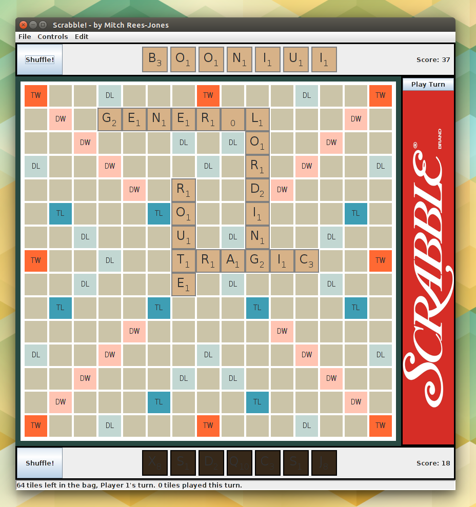
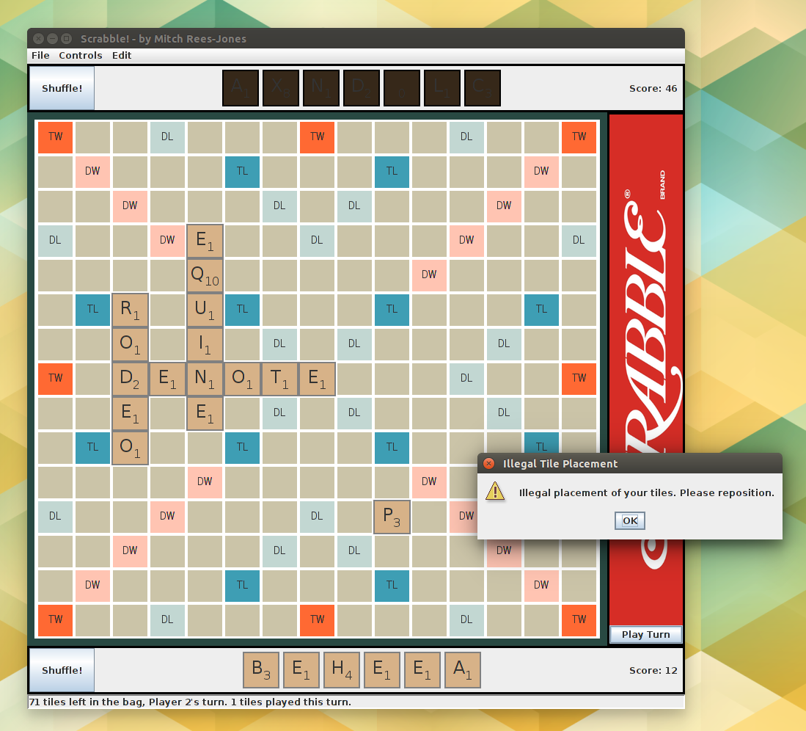
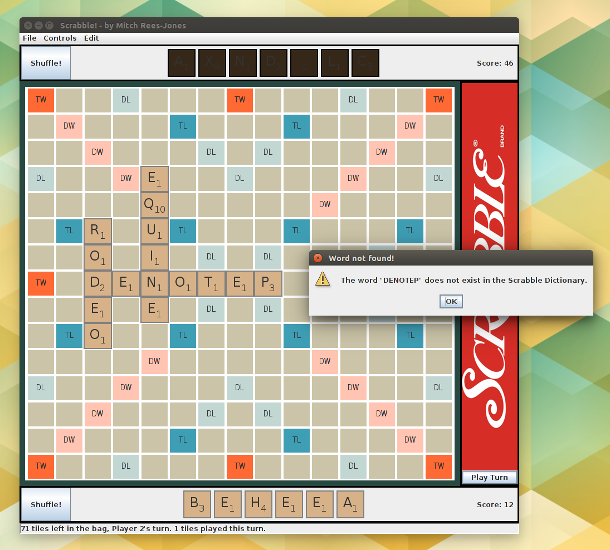

Scrabble!
========

This is a Swing-based implementation of the Scrabble board game in Java. It was
written over the course of half a school year (1 and a half trimesters) as part
of AP Computer Science II and Advanced Programming. It utilizes many of
the core concepts learned in the class, including searching and sorting, GUIs,
legal tile placement algorithms, etc.

Note: As this was my first real CS project, the code quality isn't superb. But as
David Eddings, a famous American author, said with regard to becoming a good writer,

> "Start early and work hard. A writer’s apprenticeship usually involves writing a 
> million words (which are then discarded) before he’s almost ready to begin. That 
> takes a while."

This project had 1395 SLOC (whitespace & comments excluded), so looks like I have
just 998,605 SLOC left!

## Screenshots

The basic Scrabble UI:

Tile placement is checked on each turn. A warning message is displayed when the tile
placement is illegal:

It also has a built-in English Scrabble dictionary, which can be enabled or disabled 
during gameplay:

## How to Use

Download this repository, and navigate to the root directory of the project.
Then use `java -jar dist/scrabble.jar` to run the project.

*Note:* If you aren't in the root projects directory, Java won't be able to find
the files in the resources directory (pictures, dictionary, etc.) so make sure
to run it in the correct location, e.g. from the root directory.
